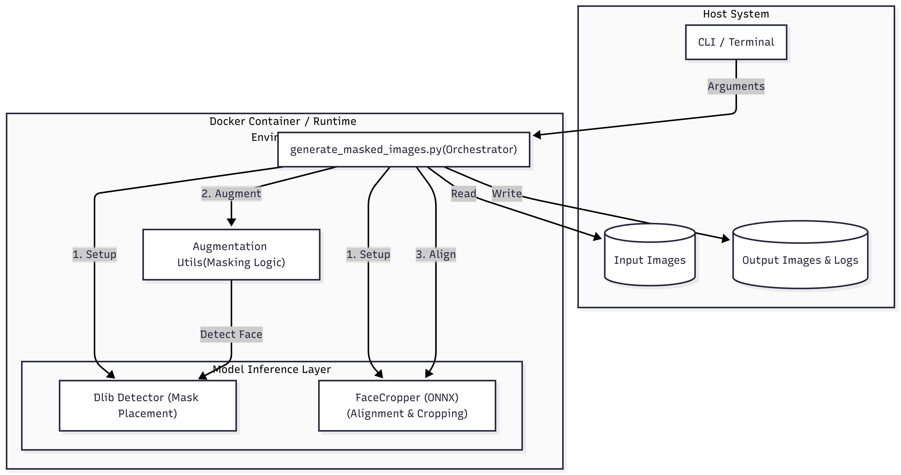
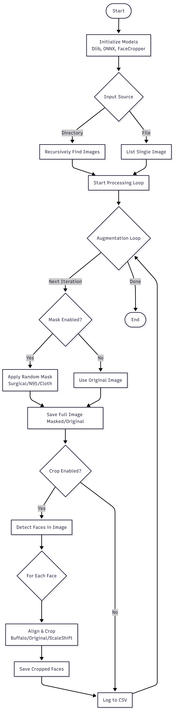
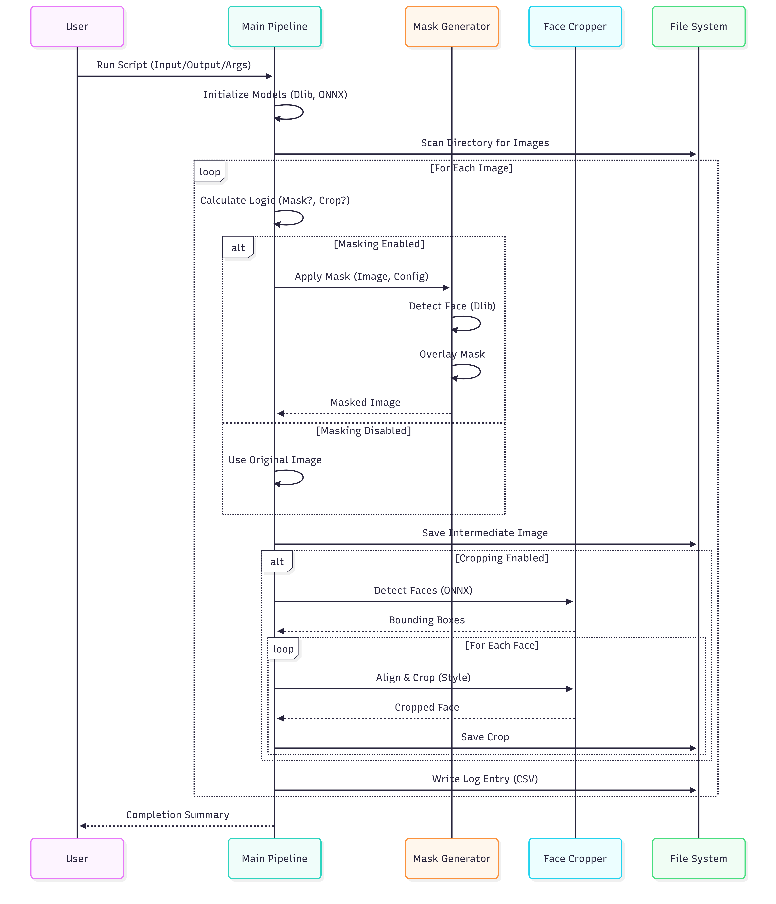

# Mask Augmentation & Face Cropping Pipeline

This project provides a robust, single-process, optimized pipeline for:
1.  **Face Mask Augmentation**: Realistically applying surgical, N95, and cloth masks to faces in images.
2.  **Face Cropping & Alignment**: Detecting faces and aligning them using various production-ready standards (e.g., Buffalo style, Production style).

The pipeline is designed for high performance, ease of use, and flexibility. It processes single images or entire directories recursively.

---

## Features

*   **Optimized Performance**: Single-process loop with `tqdm` progress bars, efficient resource reuse (ONNX/Dlib models loaded once), and reduced I/O overhead.
*   **Flexible Input**: Accepts a single image file or a directory (recursive search).
*   **Smart Logging**: Automatically logs all operations, successes, and errors to `logs.csv` in the output directory.
*   **Augmentation Control**: Generate multiple augmented versions per image.
*   **Modular Processing**: Toggle masking and cropping independently via CLI flags.
*   **Multiple Crop Styles**: Support for modern face alignment standards (`buffalo`, `original_cropping`, `scale_shift`).

### System Architecture

The following diagram illustrates the high-level components and their interactions within the system.



## Pipeline Workflow

<div style="max-height: 600px; overflow-y: auto;">
  
</div>

### Execution Sequence

This sequence diagram details the step-by-step flow of operations for a single image processing cycle.



---

## Docker Usage (Recommended)

This pipeline is optimized to run inside a Docker container, ensuring all dependencies and environment configurations are consistent without cluttering your host machine.

### 1. Build the Docker Image

Run this command from the root of the project (where the `Dockerfile` is located):

```bash
docker build -t mask-augment-pipeline .
```

### 2. Run Interactively (Recommended)

To run the script multiple times with different inputs or settings, we recommend starting the container in **interactive mode**.

1.  **Mount your data folder**: Use `-v` to map your local images folder to `/data` inside the container.
2.  **Start the shell**: This drops you into the container's terminal.

```bash
# General Command Syntax
docker run --rm -it -v "<HOST_PATH_TO_IMAGES>:/data" --gpus all (optional) mask-augment-pipeline /bin/bash
```

**Example Scenario:**
You have a large dataset drive at `/data/datasets-san-backup`.
*   Input images are in: `/data/datasets-san-backup/raw_faces`
*   You want output in: `/data/datasets-san-backup/processed_v1`

**1. Mount the parent directory:**
We map the host's `/data/datasets-san-backup` to `/data` inside the container.

```bash
docker run --rm -it -v "/data/datasets-san-backup:/data" --gpus all mask-augment-pipeline /bin/bash
```

**2. Run the script manually inside the container:**
Now, `/data` inside the container corresponds to your SAN backup. You can read from one subfolder and write to another.

```bash
# Process 'raw_faces' and save to 'processed_v1'
python3 generate_masked_images.py --input /data/raw_faces --output /data/processed_v1 --n_augmentations 2
```

Since `/data` is mapped to your host's `/data/datasets-san-backup`, the folder `processed_v1` will successfully be created on your host drive.

---

## Local Installation (Optional)

If you prefer to run the script locally instead of using Docker, ensure you have Python 3.8+ installed.

1.  **Clone the repository/Download the scripts.**
2.  **Install dependencies**:
    ```bash
    pip install -r requirements.txt
    ```
    *Core dependencies include: `numpy`, `opencv-python`, `dlib`, `tqdm`, `onnxruntime` (or `onnxruntime-gpu`), `torch`, `torchvision`, `Pillow`.*

3.  **Model Assets**:
    Ensure the `assets/` directory contains the necessary models:
    *   `assets/models/shape_predictor_68_face_landmarks.dat` (Dlib)
    *   `assets/models/onnx_models/RFB_finetuned_with_postprocessing.onnx` (Face Detection)
    *   `assets/models/onnx_models/landmark_model.onnx` (Face Landmarks)

**Example:**
Presume your images are in `C:\Users\You\Images` (Windows) or `/home/user/images` (Linux). We will mount this to `/data` inside the container.

```bash
# Windows (PowerShell/CMD)
docker run --rm -it -v "C:\Users\You\Images:/data" mask-augment-pipeline python3 generate_masked_images.py --input /data/input --output /data/output --n_augmentations 2

# Linux / Mac
docker run --rm -it -v /home/user/images:/data mask-augment-pipeline python3 generate_masked_images.py --input /data/input --output /data/output --n_augmentations 2
```

In this example:
*   We map the host folder to `/data`.
*   We tell the script to read from `/data/input` (`--input`).
*   We tell the script to write to `/data/output` (`--output`), which will appear in your host folder.

---

## Usage

The main entry point is `generate_masked_images.py`.

### Basic Command Structure

```bash
python generate_masked_images.py --input <INPUT_PATH> --output <OUTPUT_DIR> [OPTIONS]
```

### Arguments

| Argument | Type | Default | Description |
| :--- | :--- | :--- | :--- |
| `--input` | `str` | **Required** | Path to a single image file OR a directory containing images. |
| `--output` | `str` | `output` | Directory where processed images and logs will be saved. |
| `--n_augmentations` | `int` | `1` | Number of mask augmentations to generate per image. |
| `--no_mask` | `flag` | `False` | XOR Flag. If set, disables mask augmentation (only crops original images). |
| `--no_crop` | `flag` | `False` | XOR Flag. If set, disables face cropping (saves full-size augmented images). |
| `--crop_style` | `str` | `all` | Style of cropping to apply. Choices: `buffalo`, `original_cropping`, `scale_shift`, `all`. |

---

## Examples

### 1. Process an Entire Folder
Process all images in `my_dataset/`, generate 3 masked variations for each, and apply all cropping styles.
```bash
python generate_masked_images.py --input my_dataset/ --output processed_data/ --n_augmentations 3
```

### 2. Process a Single Image
Process just one image, generating 1 masked version and cropping it.
```bash
python generate_masked_images.py --input raw_data/face_01.jpg --output debug_output/
```

### 3. Generate Masks ONLY (No Cropping)
Create full-resolution masked images without cropping the face.
```bash
python generate_masked_images.py --input my_dataset/ --output masks_only/ --no_crop
```

### 4. Face Cropping ONLY (No Masks)
Crop faces from original images without applying any masks.
```bash
python generate_masked_images.py --input my_dataset/ --output crops_only/ --no_mask
```

### 5. Specific Crop Style
Only use the "Buffalo" style alignment.
```bash
python generate_masked_images.py --input my_dataset/ --crop_style buffalo
```

---

## Output Structure

The output directory will contain:
1.  **Subdirectories**: Mirroring the input directory structure (if input was a folder).
2.  **Images**:
    *   `*_masked.png`: Full masked image (if `--no_crop` is used).
    *   `*_original.png`: Original image copy (if `--no_mask` is used).
    *   `*_buffalo.jpg`, `*_original_cropping.jpg`, etc.: The aligned face crops.
3.  **`logs.csv`**: A detailed report including:
    *   `image_path`: Source file.
    *   `mask_type`, `mask_color`: applied augmentation details.
    *   `error`: Any processing errors.
    *   `output_path`: Path to the generated file.

---

## Troubleshooting

*   **Dlib Error**: If you see `RuntimeError: Unable to open ...shape_predictor_68_face_landmarks.dat`, ensure the model file exists in `assets/models/`.
*   **Face Not Found**: If no face is detected, the image will be skipped and logged in `missed_images.txt` / `logs.csv`.
 
---

## Credits

### Developed by:

**Tanmay Thaker**

Machine Learning Engineer
Gatekeeper Systems

## Guided & Supported By:
* **Ruo Jia**
---
